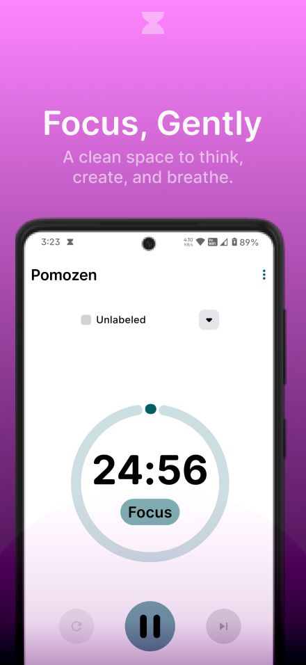
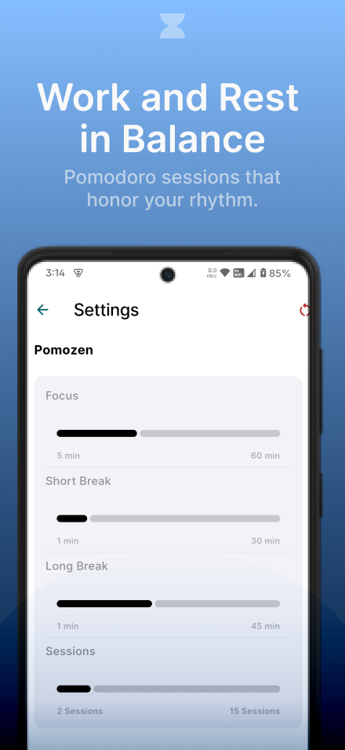
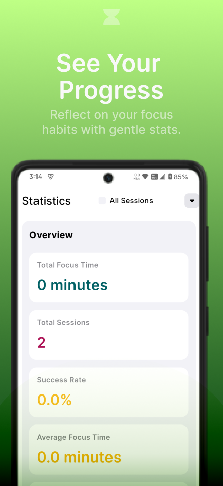
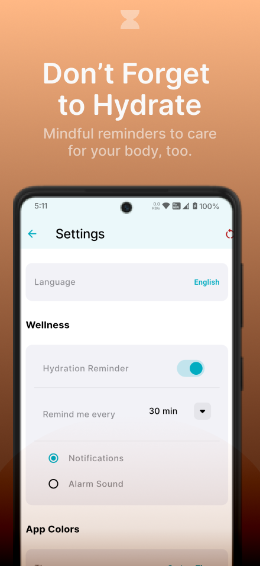
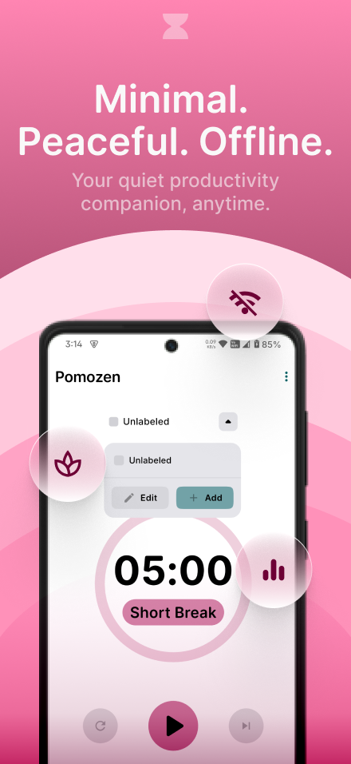

---

# ⏳ Pomozen

  &nbsp;&nbsp;&nbsp;
  &nbsp;&nbsp;&nbsp;
  &nbsp;&nbsp;&nbsp;
  &nbsp;&nbsp;&nbsp;
  

**Pomozen** is a modern, open-source **Pomodoro timer** available as both a **mobile app** and a **website**.
It applies the Pomodoro Technique—structuring work into focused intervals (typically 25 minutes) followed by short breaks.
This approach helps combat mental fatigue, maintain concentration, and improve efficiency in work or study.

---

## ✨ Key Features

* **📊 Comprehensive Statistics**
  Track focus sessions, break times, and productivity patterns. Custom labels let you track time spent on specific tasks, activities, or anything you want.

* **⏰ Customizable Reminders**
  Stay on track with personalized notifications. Smoothly transition between focus and break periods.

* **💧 Hydration Reminder**
  Get timely reminders to drink water and stay hydrated throughout your day.

* **🧘 Minimal Design**
  Clean, focused interface built with minimalism at its core—balanced spacing, calm colors, and no distractions.

* **📴 Offline Support**
  Works offline on both mobile and web (PWA ready).

* **⚙️ Fully Customizable Timer**
  While the default Pomodoro cycle is 25/5/15, you can fine-tune focus time, short/long breaks, session count, and reminder behavior to match your personal workflow.

---

## 📸 Screenshots

  
  
  
   
  
  

---

## 🔐 Privacy First

Pomozen has a **strict no data collection policy**.
All session logs and preferences are stored **only on your device/browser**—never sent to external servers or third parties.

---

## 🧰 Tech Stack

* **Flutter (Web & Mobile)** – Cross-platform UI toolkit
* **Dart** – Programming language behind Flutter
* **GetX** – Simple, fast state management and routing

---

## 🚀 Getting Started

### ▶️ Web Version

1. Open **[Pomozen Web](https://thegandabherunda.github.io/pomozen.site/)** in your browser.
2. *(Optional)* Install it as a Progressive Web App (PWA) for a native-like experience.

### 📱 Mobile App

  

1. Download the latest release from the [Releases Page](https://github.com/TheGandabherunda/Pomozen/releases).
2. Install the APK on your Android device.
3. Open **Pomozen** and adjust your Pomodoro settings to fit your workflow.

---

## 🧑‍💻 Contributing

Contributions are welcome and appreciated!
If you'd like to improve Pomozen, feel free to:

* Report bugs
* Suggest features
* Submit pull requests

Please read the [Contributing Guide](CONTRIBUTING.md) (coming soon) for details.

---

## 📄 License

Pomozen is licensed under the [Apache License 2.0](https://www.apache.org/licenses/LICENSE-2.0).

---

## 🙌 Credits

* Thanks to [@abisri99](https://github.com/abisri99) for feedback and suggestions.
* Built with [Flutter](https://flutter.dev), [GetX](https://pub.dev/packages/get), and open-source love

---

> Made with ❤️ for Web & Mobile using Flutter, Dart, and GetX.

---
